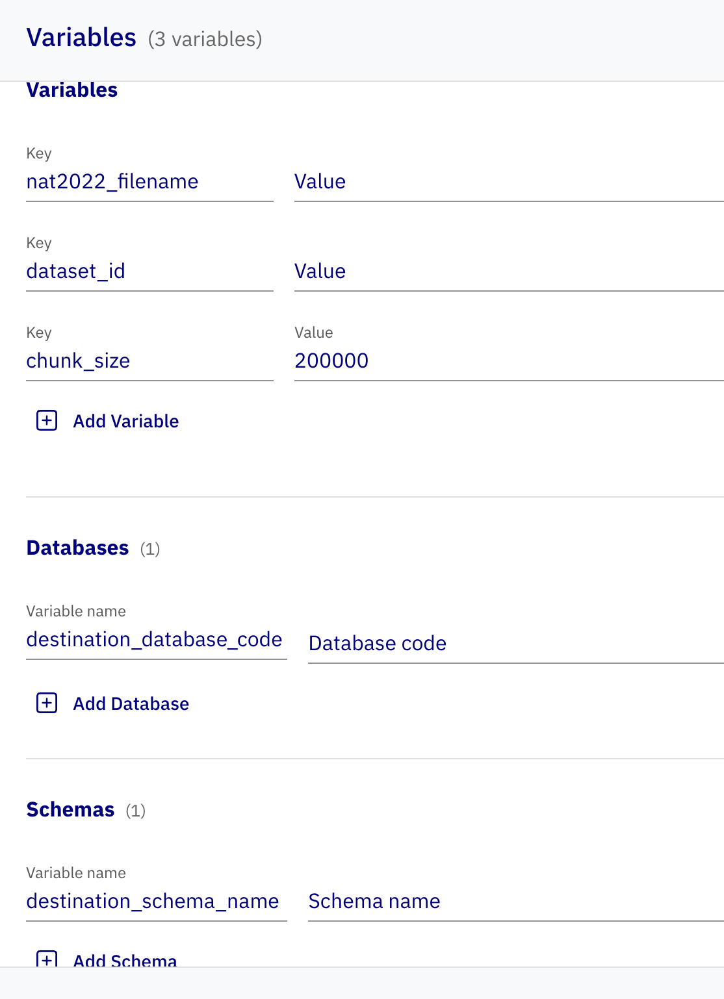
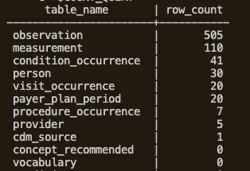

# US Birth Data to OMOP ETL Template

This runbook explains how to import and run
[`ETL_US_BirthData_to_OMOP.json`](./ETL_US_BirthData_to_OMOP.json).

## Data source

The input is the 2022 US birth public-use data from the CDC/NCHS
[Vital Statistics Online Data Portal](https://www.cdc.gov/nchs/data_access/vitalstatsonline.htm).

The template currently retains `nat2022` in several variable names and staging-file names. These are implementation names; when loading 2022 data, verify that the fixed-width positions used by the parser match the 2022 User Guide before running the complete dataset.

This guide uses:

```text
Unziped_2022_US_birth_data.txt
```

The mapping input is:

```text
Merged_US_Birth_Data.csv # necessary to be uploaded locally
```

## Prerequisites

- A running D2E environment.
- An OMOP CDM 5.4 dataset created before running the ETL.
- The dataset ID copied from the Datasets page.
- The destination database code and schema name.
- The fixed-width birth-data file available on the host.
- The `Merged_US_Birth_Data.csv` mapping file.

## Step 1: Create the dataset and set `dataset_id`

Create the destination OMOP CDM 5.4 dataset before running the flow. Creating it through the Dataset page, copy the dataset ID which will be used in later step 4.


## Step 2: Mount the source-data directory

Mount the host directory containing the fixed-width source file into the flow container at `/app/data_load`:

- Open a terminal in the d2e directory.
- Run the following commands to define directories:

```sh
export BIRTH_DATA_DIR="/absolute/path/to/birth_data"
yq -i '.services.alp-dataflow-gen-worker.volumes = ((.services.alp-dataflow-gen-worker.volumes // []) + [strenv(BIRTH_DATA_DIR) + ":/app/data_load"] | unique)' docker-compose.yml
```

Restart D2E to apply the updated container mount:

```sh
d2e stop
d2e start
```

After the restart, verify that the worker can see the mounted files:

```sh
docker exec alp-dataflow-gen-worker ls -l /app/data_load
```

## Step 3: Import and save the template

1. Import `ETL_US_BirthData_to_OMOP.json` in the ETL page within admin portal.
2. Save the imported flow immediately.

## Step 4: Configure the source filename and destination
1. Open variables setting drawer


2. Then set individual variables as showen below:


- Set dataset_id from step 1
- Set "nat2022_filename" to the filename inside `/app/data_load`:
- Set the correct destination database and schema in the flow configuration:
```text
dataset_id=<dataset_id>
nat2022_filename=<filename of Unziped 2022 US birth data.txt>
destination_database_code=<database code>
destination_schema_name=<OMOP schema name>
```

3. Save the configuration of flow immediately.

## Step 5: Upload local mapping table via CSV node

- In CSV node, upload the mapping table using exact name of `Merged_US_Birth_Data.csv`.
- Ensure that the CSV node name is `csv_node_0`

*The Python transform expects its mapping DataFrame from `csv_node_0`. A differently named or disconnected node will cause the flow to fail.

## Step 6: Run the flow

The ETL writes the following tables:

- `person`
- `visit_occurrence`
- `observation`
- `measurement`
- `condition_occurrence`
- `procedure_occurrence`
- `payer_plan_period`
- `provider`

## Step 7: Verify the cache tables

### Get the cache catalog ID

Run below command to query catalog_id using the dataset UUID configured in the ETL:

```sh
export DATASET_ID = <dataset_id>
SCHEMA_NAME = <schema_name>
CACHE_ID="$(
  docker exec d2e-minerva-postgres-1 \
    psql -U postgres -d alp -tA \
    -c "SELECT cache_id FROM portal.dataset WHERE id = '${DATASET_ID}'::uuid;"
)"
```

If the deployment uses a different `PROJECT_NAME`, replace `d2e-minerva-postgres-1` and `d2e-trex` with the actual Minerva PostgreSQL container name shown by:

```sh
docker ps --filter 'name=minerva-postgres' --format '{{.Names}}'
docker ps --filter 'name=trex' --format '{{.Names}}'
```

### 1. First list the destination tables
Run below command to get the list of all tables in target schema

```sql
TREX_SQL_PASSWORD="$(
  docker exec d2e-trex printenv TREX__SQL__PASSWORD
)"

docker exec -i \
  -e PGPASSWORD="$TREX_SQL_PASSWORD" \
  d2e-minerva-postgres-1 \
  psql \
    -h d2e-trex \
    -p 5433 \
    -U postgres \
    -d "$CACHE_ID" \
    -v table_catalog="$CACHE_ID" \
    -v table_schema="$SCHEMA_NAME" \
    -tA <<'SQL'
SELECT
    table_catalog,
    table_schema,
    table_name
FROM information_schema.tables
WHERE table_catalog = :'table_catalog'
  AND table_schema = :'table_schema'
  AND table_type = 'BASE TABLE'
ORDER BY table_name;
SQL
```

### 2. List the row counts of each table in target schema
- Generate exact `COUNT(*)` queries for all tables in the destination schema

```sh
COUNT_QUERY="$(
docker exec -i \
  -e PGPASSWORD="$TREX_SQL_PASSWORD" \
  d2e-minerva-postgres-1 \
  psql \
    -h d2e-trex \
    -p 5433 \
    -U postgres \
    -d "$CACHE_ID" \
    -v table_catalog="$CACHE_ID" \
    -v table_schema="$SCHEMA_NAME" \
    -tA <<'SQL'
SELECT string_agg(
    'SELECT '''
    || replace(table_name, '''', '''''')
    || ''' AS table_name, COUNT(*) AS row_count FROM "'
    || replace(table_catalog, '"', '""')
    || '"."'
    || replace(table_schema, '"', '""')
    || '"."'
    || replace(table_name, '"', '""')
    || '"',
    ' UNION ALL '
) || ' ORDER BY row_count DESC'
FROM information_schema.tables
WHERE table_catalog = :'table_catalog'
  AND table_schema = :'table_schema'
  AND table_type = 'BASE TABLE';
SQL
)"
```

- Display the row counts of each table in target schema

```sh
docker exec \
  -e PGPASSWORD="$TREX_SQL_PASSWORD" \
  d2e-minerva-postgres-1 \
  psql \
    -h d2e-trex \
    -p 5433 \
    -U postgres \
    -d "$CACHE_ID" \
    -c "$COUNT_QUERY"
```
A sample dataset with 10 rows will result in 30 rows in person table:


## Common failures

- **Import libraries disappear:** Save the flow immediately after importing the JSON.
- **Source file is not found:** Confirm the host-directory mount and `nat2022_filename` value.
- **Wrong cache receives data:** Confirm that `dataset_id` is the ID returned for the intended Web API dataset.
- **Wrong destination:** Confirm both `destination_database_code` and `destination_schema_name`.
